# Load tests on GuidePRO application
Application is my team's Bachelor of engineering project. 
For now application on Github has a private visibility.

## Test preview:
Our application has requirement to be able to handle 3000 of end users in total.
In this set of load tests we are going to send this amount of responses in different
periods of time to test capabilities of our back-end service.

### 1 Case:
3000 requests in 150 seconds(2.5 min.)
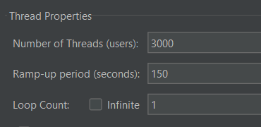
 
Results in latency are:
 
Average - 7ms
 
Min - 5ms
 
Max - 18ms
 
Error percentage - 0%
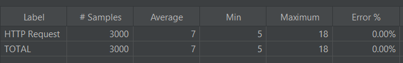
### 2 Case:
3000 requests in 120 seconds(2 min.)

 
We don't see any significant change in latency.
 
Results in latency:
 
Average - 7ms
 
Min - 5ms
 
Max - 13ms
 
Error percentage - 0%
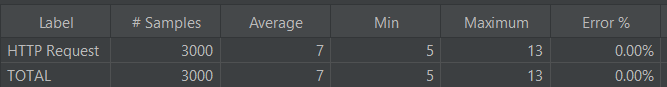
### 3 Case:
3000 requests in 90 seconds(1.5 min.)
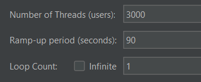
 
We can observe very small increase in maximum latency, to be specific 3ms.
This change won't really cause any issue in application.

 
Results in latency:
 
Average - 7ms
 
Min - 5ms
 
Max - 31ms
 
Error percentage - 0%

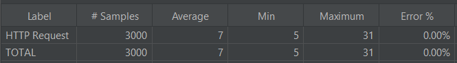
### 4 Case:
3000 requests in 60 seconds
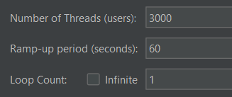
 
We can observe minimal decrease in average, min and max latency.
It's not really a change which make a difference for us.

 
Results in latency:
 
Average - 6ms
 
Min - 4ms
 
Max - 14ms
 
Error percentage - 0%

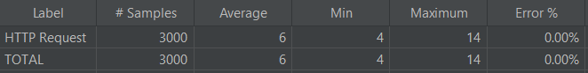
### 5 Case:
3000 requests in 40 seconds

 
We can observe increase in average latency. It almost doubled, 
but still is only 24ms so we don't see it as an issue.

 
Results in latency:
 
Average - 6ms
 
Min - 4ms
 
Max - 24ms
 
Error percentage - 0%

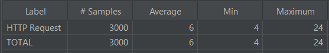
### 6 Case:
3000 requests in 30 seconds
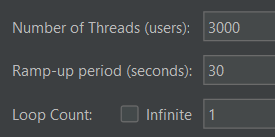
 
We don't see any significant changes in latency.

 
Results in latency:
 
Average - 6ms
 
Min - 4ms
 
Max - 28ms
 
Error percentage - 0%

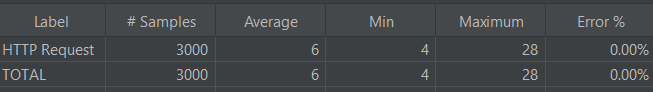
### 7 Case:
3000 requests in 20 seconds

 
We can see first significant increase in maximum latency.
It increased 3.5 times. Still it didn't reached 100ms, so 
it's not causing any real issues, but it can be sign of reaching 
the first limit. 

 
Results in latency:
 
Average - 7ms
 
Min - 4ms
 
Max - 81ms
 
Error percentage - 0%

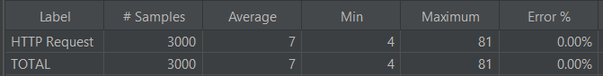
### 8 Case:
3000 requests in 15 seconds
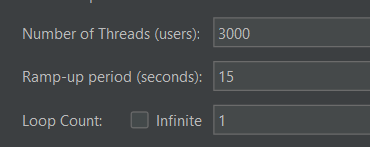
 
We can see one more time decrease of average latency. 
It's a sign that previous assumption about reaching 
the first limit was incorrect.

 
Results in latency:
 
Average - 8ms
 
Min - 4ms
 
Max - 26ms
 
Error percentage - 0%

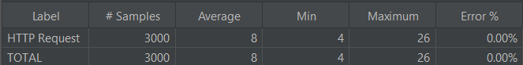
### 9 Case:
3000 requests in 10 seconds
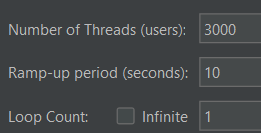
 
We can now finally declare that we reached first limit. Limit of 
high increasing of latency. Average latency jumped from 8ms to over 
1000ms. Max latency increased from 26ms to over 4.5 thousands ms. 
Test will be continued to find next limits, like for example when first 
HTTP connections errors will appear.

 
Results in latency:
 
Average - 1041ms
 
Min - 7ms
 
Max - 4549ms
 
Error percentage - 0%

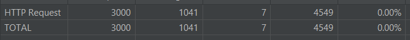
### 10 Case:
3000 requests in 6 seconds
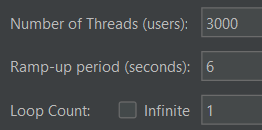
 
One more time we can see increase in average and maximum latency. 
Average latency trippled from 1s to 3s, and max latency doubled 
from 4.5s to 9.5s. Test will be continued to find first occuring 
HTTP connections errors.

 
Results in latency:
 
Average - 3144ms
 
Min - 9ms
 
Max - 9479ms
 
Error percentage - 0%

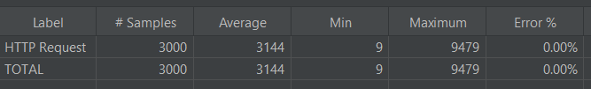
### 11 Case:
3000 requests in 4 seconds
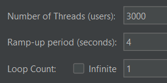
 
We've reached new limit. Average and maximum latency decreased, 
but also error percentage jumped from 0% to 47.67%. We reached 
limit where we stop to continue load testing.

 
Results in latency:
 
Average - 3144ms
 
Min - 9ms
 
Max - 9479ms
 
Error percentage - 47.67%

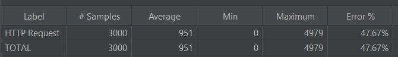